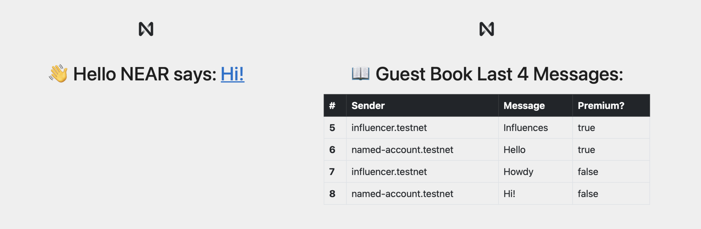

# Interact With Multiple Contracts 
[](https://docs.near.org/tutorials/welcome)
[](https://docs.near.org/develop/contracts/anatomy)
[](https://docs.near.org/develop/integrate/frontend)

A frontend-only example showing how to interact with multiple contracts simultaneously.




# What This Example Shows

1. How to view methods in multiple contracts.
2. How to call methods in multiple contracts simultaneously.

<br />

# Multiple Transactions
`near-api-js` allows to dispatch multiple transactions simultaneously, so the user interacts with the wallet only once. However, the transactions remain **independent**.

```js
const guestTx = {
  receiverId: GUEST_ADDRESS,
  actions: [
    // You can batch actions against a contract: If any fails, they ALL get reverted 
    {
      type: 'FunctionCall',
      params: {
        methodName: 'add_message', args: { text: greeting.value },
        gas: THIRTY_TGAS, deposit: GUEST_DEPOSIT
      }
    }
  ]
}

const helloTx = {
  receiverId: HELLO_ADDRESS,
  actions: [
    {
      type: 'FunctionCall',
      params: {
        methodName: 'set_greeting', args: { greeting: greeting.value },
        gas: THIRTY_TGAS, deposit: NO_DEPOSIT
      }
    }
  ]
}

// Ask the user to sign the **independent** transactions
await wallet.signAndSendTransactions({ transactions: [ helloTx, guestTx ] })
```

In this example, the user signs two independent transactions:
1. A transaction to call `set_greeting` in our [Hello NEAR example](https://github.com/near-examples/hello-near-rust)
2. A transaction to call `add_message` in our [GuestBook example](https://github.com/near-examples/guest-book-rust)

**Important Note:** Even when the user accepts signing the transactions at the same time, the
transactions remain **independent**. This is, if one fails, the other is **NOT** rollback.

> In NEAR, only [Actions](https://docs.near.org/develop/contracts/actions) against a same contract can be batched, so if one action fails they all get reverted.


# Quickstart

Clone this repository locally or [**open it in gitpod**](https://gitpod.io/#/https://github.com/near-examples/hello-near-js). Then follow these steps:

### 1. Install Dependencies
```bash
npm install
```

### 2. Start the Frontend
Start the web application to interact with your smart contract 
```bash
npm start
```

---

# Learn More
1. Learn more about the contract through its [README](./contract/README.md).
2. Check [**our documentation**](https://docs.near.org/develop/welcome).